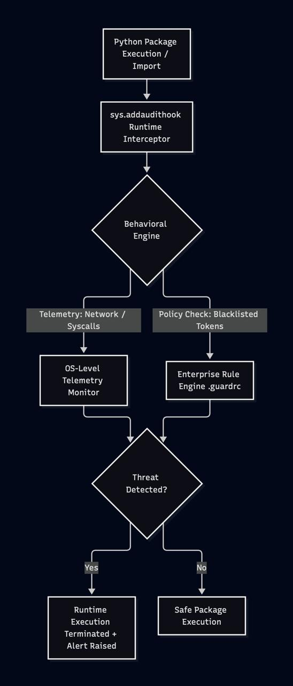

# PYPI: https://pypi.org/project/supply-chain-guard/
[](https://pypi.org/project/supply-chain-guard/)
[](https://pypi.org/)
[](https://opensource.org/licenses/MIT)
[](https://pepy.tech/project/supply-chain-guard)
## 🛡 Features

- **Import Interception:** Blocks unauthorized access to sensitive environment variables (e.g., `AWS_SECRET_ACCESS_KEY`, `DATABASE_URL`) during package initialization.
- **File System Guard:** Prevents third-party packages from reading sensitive files like `~/.ssh/id_rsa` or `~/.aws/credentials`.
- **OS-level Telemetry & Execution Prevention:** Uses Python's native Audit Hooks (PEP 578) to actively block remote code execution (`os.system`, `subprocess`) and reverse shell network connections (`socket.connect`) at the moment a suspicious package is imported.


## 🚀 Installation

Install the package via pip:
```bash
pip install supply-chain-guard
```
## 🛡️ Usage

## ⚙️ Enterprise Configuration (`.guardrc`)

By default, protection works out of the box. To block custom proprietary secrets, place `.guardrc` in your project root:

```json
{
  "version": "1.0",
  "blocked_env_vars": [
    "INTERNAL_CORP_TOKEN",
    "CUSTOM_DB_PASS"
  ],
  "blocked_paths": [
    "/etc/internal_certs"
  ]
}
```
Or set a custom path via environment variable:
```Bash
export GUARD_CONFIG_PATH="/path/to/company_policy.json"
```

### Option 1: Direct Import
Import the guard at the very first line of your entry point script (main.py, app.py, etc.) to protect your application:

```python
import supply_chain_guard  # Protection starts here
import requests
# ... your other imports
```

### Option 2: Protect Environment
1. Run in your environment 'setup_protection.sh' it will make your repository protected as long as you use this (virtual) environment
```bash
chmod +x ./setup_protection.sh
```
2. Execute setup_protection.sh
```bash
./setup_protection.sh
``` 

### Option 3: Protecting Jupyter Notebook Servers

If you manage a Jupyter server for students or a team, you can enforce security globally. This ensures that every notebook is protected, even if users try to install malicious packages themselves.

#### Steps for Administrator:

1. Install the package in the Python environment used by your Jupyter server:
   ```bash
   pip install supply-chain-guard
   ```

2. Get the startup directory for IPython Notebook
   ```bash
   python -c "from IPython import get_ipython; print(get_ipython().profile_dir.startup_dir)"
   ```

3. Create '0_force_imports.py' 
   ```python
    # ~/.ipython/profile_default/startup/force_imports.py
    try:
        import supply_chain_guard
        print("✅ Supply Chain Guard installed")
    except ImportError as e:
        print(f"⚠️  Import Not implemented: {e}") 
   ```
4. Restart IPyhton Notebook Server and it will force 'supply_chain_guard' to all kernels of Jupyter


### < Installation by hand >
<details>
<summary>Show</summary>

> python3 -m venv venv

> source venv/bin/activate

> pip install -e .

Test packages isntallation

> pip install -e test_package/clean_pkg

> pip install -e test_package/malware_pkg

> pip install -e test_package/sheep_package #which has dependency from 'malicious' wolf_package
</details>

## Architecture & Detection Pipeline
<details>
<summary>View Schema Image</summary>


</details>

<details>

<summary>View Mermaid Source</summary>

```mermaid
graph TD
    A[Python Package Execution / Import] --> B[sys.addaudithook Runtime Interceptor]
    B --> C{Behavioral Engine}
    C -->|Telemetry: Network / Syscalls| D[OS-Level Telemetry Monitor]
    C -->|Policy Check: Blacklisted Tokens| E[Enterprise Rule Engine (.guardrc)]
    D --> F{Threat Detected?}
    E --> F
    F -->|Yes| G[Runtime Execution Terminated + Alert Raised]
    F -->|No| H[Safe Package Execution]
```

</details>


## Overview & Strategic Importance
**Supply-Chain-Guard** is an automated, container-ready dynamic analysis framework designed to detect and intercept malicious code execution in Python third-party dependencies during runtime and installation.

Targeting critical software supply chain vulnerabilities (such as typosquatting, dependency confusion, and hidden payloads), this project aligns with **U.S. Executive Order 14028 (Improving the Nation's Cybersecurity)** and adheres to the **NIST SP 800-218 Secure Software Development Framework (SSDF)**.